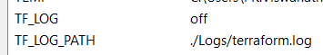
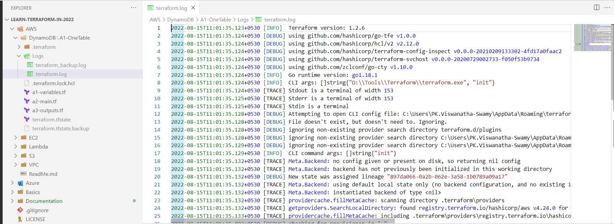
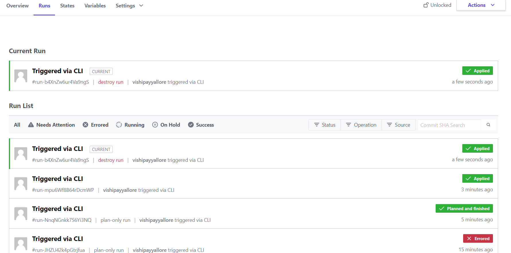

# Learn Terraform in 2022

I am learning Terraform from different books, website, and video courses.

## Terraform Logs

**Reference(s):**

> 1. https://www.terraform.io/cli/config/environment-variables

**Environment Variables**



**Terraform Logs**



## About Terraform State

**State in Terraform Cloud**



## Terraform Commands

```terraform
terraform init
terraform init -upgrade
terraform validate
terraform plan
terraform apply -auto-approve
terraform show
terraform destroy
```

## Azure CLI

```bash
az login
az account list
az account list-locations -o table
```

## Create EKS Cluster

```bash
ssh -i "vm-jenkinsserver.pem" username@YourFQDN.compute.amazonaws.com

eksctl create cluster --name ekscluster-12aug2022 --region us-east-2 --node-type t2.medium

eksctl delete cluster --region=us-east-2 --name=ekscluster-12aug2022
```

## Install Terraform on Windows

```bash
mkdir C:\terraform
cd C:\terraform

Invoke-WebRequest -Uri https://releases.hashicorp.com/terraform/1.2.7/terraform_1.2.7_windows_amd64.zip -outfile terraform_1.2.7_windows_amd64.zip

Expand-Archive -Path .\terraform_1.2.7_windows_amd64.zip -DestinationPath .\
rm .\terraform_1.2.7_windows_amd64.zip -Force

setx PATH "$env:path;C:\terraform" -m

$env:Path = [System.Environment]::GetEnvironmentVariable("Path","Machine") + ";" + [System.Environment]::GetEnvironmentVariable("Path","User")

terraform version
```

## Install Terraform on Linux

```bash
cd ~/

wget https://releases.hashicorp.com/terraform/1.2.7/terraform_1.2.7_linux_amd64.zip

unzip terraform_1.2.7_linux_amd64.zip

sudo mv terraform /usr/local/bin

terraform version
```

```
wget https://releases.hashicorp.com/terraform/1.2.7/terraform_1.2.7_linux_amd64.zip
sudo unzip terraform_1.2.7_linux_amd64.zip -d /usr/local/bin/
rm terraform_1.2.7_linux_amd64.zip
terraform version

```
